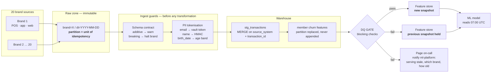
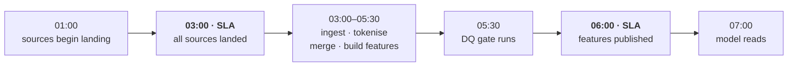
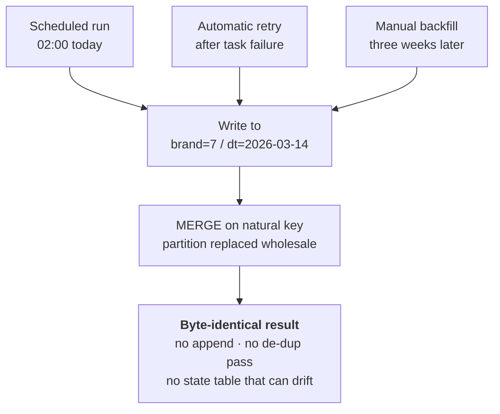

# Part 3 — Pipeline Design

**Section:** Pipeline & Modelling · **Status:** Complete

**The ask.** Design doc for running daily across 20 brands at ~50x volume: ingestion and idempotency, schema drift, a DQ SLA and alerting, PII handling, and one orchestration choice with reasons.

## Scale assumption

"50x current volume" is ambiguous, so I state the reading: **each daily run processes
~10M transaction rows and ~2.5M member records across 20 brands** (194K × 50, fanned out
over 20 brands rather than 3). If the intended reading is 50x the *daily rate* — closer to
30K rows/day — the same architecture holds with smaller compute. **The design is driven by
20-brand multi-tenancy and a hard morning SLA, not by row count.** Nothing here changes if
the volume estimate is off by an order of magnitude; the failure modes are the same.

---

## Architecture

Read left to right. The two things the diagram is trying to make obvious: **the guards run
before the warehouse, not after it**, and **the gate sits between the feature build and the
model** — so a failure degrades freshness, never correctness.



Brands fan out and fail independently: one late feed holds back one brand, not nineteen
healthy ones.

### Daily timeline



The hour between publication and the model read is deliberate. A pipeline that finishes
exactly at its deadline has no room for a single retry, and retries are the normal case,
not the exception.

## 1. Ingestion and idempotency

**Ingestion.** Incremental pull per brand by watermark (`ingested_at`), landed as Parquet
into an immutable raw zone partitioned `brand=X/dt=YYYY-MM-DD`. Raw is never mutated —
re-processing re-reads, it does not re-fetch.

**Idempotency comes from deterministic addressing, not bookkeeping.** Two mechanisms, and
neither requires the pipeline to remember what it has already done:

1. **Partition-level replacement.** Every task writes to a partition keyed on
   `(brand, logical_date)` and replaces it wholesale. Airflow's `logical_date` — not
   `now()` — determines the path, so a re-run for 2026-03-14 always targets the same
   partition. Re-running is overwrite, never append.
2. **`MERGE` on the natural key at load.**

```sql
MERGE INTO stg_transactions AS t
USING (SELECT * FROM raw WHERE brand = :brand AND dt = :ds) AS s
  ON  t.source_system  = s.source_system
  AND t.transaction_id = s.transaction_id
WHEN MATCHED AND t.row_hash <> s.row_hash THEN UPDATE SET *
WHEN NOT MATCHED THEN INSERT *;
```

**The key is `(source_system, transaction_id)`, not `transaction_id`.** This is the direct
lesson of Part 1: DQ-04 found 1,936 rows appended by a non-idempotent retry, and DQ-05
found **59 ids reused across source systems**. Merging on the id alone would have been
idempotent *and wrong* — silently discarding 59 real transactions to achieve it.

Three different callers, one destination — which is what makes replay safe:



**Why no "have I processed this?" state table:** because that state can desynchronise from
reality, and then you have two sources of truth about what happened. Deterministic
addressing cannot drift.

Backfill uses the same code path — `catchup=True` and a date-parameterised DAG — rather
than a separate script, so the replay path is exercised daily instead of being discovered
during an incident.

## 2. Schema drift

Contracts are versioned in source control and checked **at ingest, before
transformation**. Drift is **classified, not merely detected**, because the right response
differs:

| Class | Example | Response |
|---|---|---|
| **Additive** | new column appears | Ingest, alert `#data-quality`, open a ticket. Do not halt |
| **Breaking** | type change, column removed, key changes | **Halt that brand**, quarantine the batch, page on-call |
| **Value-level** | unknown enum value | Quarantine the *row*, continue the batch |

The classification is the design decision. Halting on an added column teaches people to
ignore the alert channel within a fortnight; continuing through a retyped column corrupts
the feature store silently. Both failure modes are common and both are avoidable by
distinguishing them.

Two contract terms exist specifically because Part 1 found their absence:

- `transaction_date` is pinned to **ISO-8601**. DQ-08 found three formats in one column
  precisely because no contract existed and the reader was left to guess.
- `members` requires **`valid_from` / `valid_to` / `is_current`**. DQ-03 found 150 members
  with two contradictory rows and no way to identify the current one, because the source
  flattened a Type-2 dimension to Type-1 on export.

## 3. Data quality SLA and alerting

### The SLA — the commitment, before the checks

An SLA is a promise with numbers and an owner, not a list of checks. Ours:

| Commitment | Target | Breach response |
|---|---|---|
| Source data landed | **03:00 UTC** | Brand skipped this run; `#data-quality` alerted |
| Features published | **06:00 UTC** (model reads 07:00) | Page on-call — 1h of slack remains |
| Max feature staleness served | **26h** | Beyond this, serving stops and the model is told to hold |
| Completeness per brand | **≥ 99.9%** of expected rows | Blocking — previous snapshot stays live |
| Brands published per run | **20 / 20** | Partial success reported explicitly, never as green |
| Owner | Data Platform team, 24/7 on-call rota | — |

The number that matters most is the **26-hour staleness ceiling**, because it is the one
that decides the trade this whole design turns on: *past this point, serving yesterday's
features is worse than serving none*. Everything else is machinery in service of it.

### "Safe to serve" is a gate, not a dashboard

**Publication depends on the gate task.** A check that fires after the model has read the
data is a report, not a control.

Every check carries a severity that determines pipeline behaviour:

| Severity | Behaviour |
|---|---|
| **blocking** | Feature store is **not** published for that brand; previous snapshot stays live; on-call paged |
| **warning** | Publish, alert `#data-quality`, open a ticket |

The check set, each traced to the Part 1 finding that motivated it — a control that
cannot be traced to an observed failure tends to be theatre:

| Check | Severity | Why |
|---|---|---|
| `freshness_source_arrival` | blocking | Stale input produces stale features and the model cannot tell |
| `volume_within_expected_band` (0.5×–2× trailing same-weekday median) | blocking | **Catches partial loads** — more dangerous than total failures, because a 60%-complete brand looks like a real business drop. This is the check that catches Part 4's incident on day one |
| `primary_key_unique` | blocking | DQ-04 / DQ-05 |
| `no_duplicate_current_member_rows` | blocking | DQ-03 |
| `amount_non_negative`, `amount_within_plausible_range` | blocking | DQ-07, DQ-02 |
| `transactions_resolve_to_member` (orphan rate < 0.1%) | warning + quarantine | DQ-06 — recoverable once the member feed lands; blocking would stop good data for a fixable gap |
| `points_match_earn_rate` | warning | DQ-06 determinism; doubles as a business control — an unannounced earn-rate change surfaces here before Finance finds it in the liability |
| `feature_null_rate_stable` | **blocking** | **Part 4's signature exactly.** A model scoring on silently-nulled inputs is worse than a model that did not run |
| `feature_distribution_stable` (PSI < 0.2) | warning | Inputs can be individually valid and collectively shifted |

**Alerting is routed by severity, not broadcast.** Blocking → page on-call **and** notify
`#ml-platform` that a stale snapshot is being served, for which brand and how old.
Consumers are told; they do not discover it. Warnings → `#data-quality`, no page.

**Brands fail independently.** One brand's late feed must not hold back the other 19, so
fan-out and gating are both per-brand, and a partial success is reported as a partial
success rather than a green DAG.

## 4. PII handling

**Tokenise between raw landing and staging — not at the end.** Anything later means
clear-text PII is queryable by every analyst for the window it sits in staging. Part 1
(DQ-13) found exactly that end state: 50,160 rows of unmasked email, name and birth date
in a flat file.

| Field | Treatment | Why this and not something stronger/weaker |
|---|---|---|
| `email` | **Vault token** (reversible, break-glass, audited) | Must stay reversible: it is the only identity-resolution key, and a DSAR arrives as an email address. DQ-12 found 20 emails across multiple `member_id`s — **a DSAR keyed on `member_id` returns an incomplete record** and appears satisfied while personal data remains undisclosed |
| `first_name`, `last_name` | **HMAC-SHA256**, rotating salt, irreversible | No analytical use. HMAC not plain hash — a plain hash of a first name is trivially rainbow-tabled |
| `birth_date` | **Generalised to age band** at ingest, raw date discarded | The model only ever used age. Storing a precise DOB to derive a band is retaining a direct identifier for no benefit |
| `member_id` | Pseudonymous surrogate, kept | Not PII alone; needed as the join key throughout |

Supporting controls: PII columns tagged in the catalogue and enforced (a new column tagged
`pii: true` cannot reach the analytics zone untokenised); raw zone is deny-by-default with
short retention; analysts see masked views only; token vault access is separately
audited. **The feature store contains no direct identifiers at all** — features are
behavioural aggregates keyed on a surrogate.

## 5. Orchestration: Airflow

**Choice: managed Airflow (MWAA / Cloud Composer).**

Four reasons specific to this problem:

1. **Backfill and replay are first-class.** `logical_date` + `catchup` make "re-run 14 days
   for brand 7" a supported operation, not a bespoke script. Given that idempotency is the
   central requirement here, an orchestrator whose scheduling model is built on
   deterministic date parameterisation is doing half the work.
2. **Dynamic task mapping over 20 brands** from config, with independent per-brand
   success/failure. Adding brand 21 is a config change, not a DAG change.
3. **Heterogeneous sources.** 20 brands will not all deliver the same way — S3 drops, APIs,
   database CDC. Airflow's sensor and provider ecosystem covers this; warehouse-native
   schedulers assume the data is already in the warehouse, which is the part that is
   actually hard.
4. **It orchestrates rather than computes**, so the DQ gate, the tokenisation step and the
   feature build can each run on whatever engine suits them without the orchestrator
   becoming the thing that dictates the stack.

**The cost, stated plainly:** Airflow is real operational overhead — a scheduler to run,
dependency conflicts to manage, and a UI that makes it easy to build DAGs nobody can
follow. Managed hosting removes most but not all of that.

**The one condition under which I would switch:** if all compute already runs on Databricks,
Databricks Workflows removes a moving part and keeps lineage in Unity Catalog, and the
Airflow overhead stops being worth it. That is a fact about the existing estate, not about
this pipeline — and it is the question I would ask before finalising.

**dbt is not an alternative here, it is a complement.** It has no scheduler, no sensors and
no concept of waiting for a file to land. If the transformation layer grows, I would run
dbt *inside* this DAG for the SQL models and keep Airflow for orchestration.

---

## What this design says about the two-day delay in Part 5

The blocking gate is the reason churn scores get delayed rather than wrong. Under the old
one-off pull, bad data flowed straight through to the model. Under this design, a brand
failing a blocking check holds its previous snapshot and pages a human — correct, and
visibly slower. That trade is the substance of the Part 5 message.

See `decision_log.md` for rejected alternatives.
