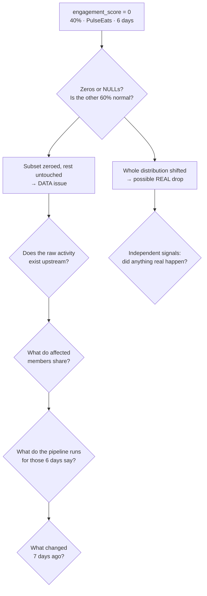

# Part 4 — Production Incident

**Section:** Pipeline & Modelling · **Status:** Complete · *(thinking exercise — no code)*

**The ask.** `engagement_score` dropped to 0 for ~40% of PulseEats members over the same 6-day window. What to check and in what order, with which queries — and the top 3 hypotheses, ranked.

## The answer, first

**No — don't escalate yet.** I'd say so in the thread within five minutes, before running a
single query, because the *shape* of the anomaly is already diagnostic:

| Signature | What it rules out |
|---|---|
| Exactly **0**, not NULL | Real disengagement produces low-but-varied scores. An exact zero across thousands of members is a **default value**, not a measurement |
| **One brand only** | Brand maps to a feed. Human behaviour does not respect source-system boundaries this cleanly |
| **The same 6-day window** for everyone | A sharp start *and* end. 40% of people do not synchronise their disengagement to the same six days |
| **~40%** | Behaviour is continuous. 40% is the fingerprint of a **partition** — a shard, a join miss, a release cohort |

Four independent properties, all pointing away from a business event. Not proof — but
enough to justify holding the escalation while I verify, which costs the brand team nothing
and costs us credibility if I get it wrong in the other direction.

**Holding message in the thread:**

> Looking at this now. The pattern — exactly zero rather than low, one brand, one bounded
> window — looks more like a data issue on our side than a real drop. Verifying before we
> take it to the brand team. Update within the hour.

Escalating a pipeline bug to a brand team burns their time and your credibility. Sitting on
a real drop is worse. So the ordering principle below is: **eliminate the largest share of
the hypothesis space per unit of time, and rule the scary option out by evidence rather
than by assumption.**

---

## Triage order



### Step 1 — Characterise it precisely (2 min)

Before explaining it, measure it. Zeros or nulls, exact window boundaries, and — the
decisive part — **whether the unaffected 60% look normal**.

```sql
SELECT feature_date, brand,
       count(*)                                                    AS members,
       count(*) FILTER (WHERE engagement_score = 0)                 AS zeros,
       count(*) FILTER (WHERE engagement_score IS NULL)             AS nulls,
       round(avg(engagement_score) FILTER (WHERE engagement_score > 0), 3) AS avg_nonzero,
       round(median(engagement_score) FILTER (WHERE engagement_score > 0), 3) AS p50_nonzero
FROM feature_store_daily
WHERE feature_date >= current_date - INTERVAL 28 DAY
GROUP BY 1, 2 ORDER BY 2, 1;
```

**This single query is the fork in the road.** A real engagement drop shifts the *whole
distribution* down — `avg_nonzero` and `p50_nonzero` fall. A data failure sends a *subset*
to exactly zero and leaves everyone else untouched. If the non-zero population is
unchanged, the business hypothesis is effectively dead and the rest of the triage is about
finding the mechanism.

### Step 2 — Does the raw activity exist? (5 min)

Walk one layer upstream, from the feature to the events it is built from.

```sql
SELECT date_trunc('day', transaction_ts) AS d,
       count(*) AS events, count(DISTINCT member_id) AS members
FROM stg_transactions
WHERE brand = 'PulseEats'
  AND transaction_ts >= current_date - INTERVAL 28 DAY
GROUP BY 1 ORDER BY 1;
```

This splits the remaining space in half:

- **Source rows missing** → ingestion / delivery failure (H1)
- **Source rows present, feature still 0** → transformation or join defect (H2)

### Step 3 — What do the affected members have in common? (10 min)

The mechanism is usually written on the affected population. Compare affected vs
unaffected across every available dimension at once:

```sql
WITH affected AS (
  SELECT DISTINCT member_id FROM feature_store_daily
  WHERE brand = 'PulseEats' AND engagement_score = 0
    AND feature_date BETWEEN :win_start AND :win_end
)
SELECT coalesce(a.member_id IS NOT NULL, false) AS is_affected,
       m.source_system, m.country, m.tier,
       substr(m.member_id, 1, 2)               AS id_namespace,
       date_trunc('month', m.join_date)        AS join_cohort,
       count(*)                                AS members
FROM members m LEFT JOIN affected a USING (member_id)
WHERE m.brand = 'PulseEats'
GROUP BY 1,2,3,4,5,6 ORDER BY 1, members DESC;
```

What each answer would mean:

| If affected members cluster on… | Then |
|---|---|
| One `source_system` or `id_namespace` | Identity/join failure — **and there is precedent**: Part 1 found 2,988 transactions in a separate `M9000000+` id namespace from an unloaded source |
| One channel (e.g. `app`) | Instrumentation — a tracking SDK or app release |
| Nothing at all — a clean random 40% | Sharding or partial file delivery |

### Step 4 — What do the pipeline runs say? (5 min)

**Airflow UI / metadata DB** for the six logical dates: task states, retries, skips,
duration outliers, and specifically whether `wait_for_source` skipped PulseEats.

```sql
SELECT dag_id, task_id, execution_date, state, try_number, duration
FROM task_instance
WHERE dag_id = 'churn_feature_pipeline'
  AND execution_date BETWEEN :win_start AND :win_end
  AND (state <> 'success' OR try_number > 1)
ORDER BY execution_date, task_id;
```

Plus the DQ check results for those dates — **the most important question of the whole
triage is whether the gate passed.** If PulseEats' volume check passed at 60% of normal
volume, the threshold is wrong and that is a second, separate finding.

### Step 5 — What changed? (5 min)

Correlate the window's *start* with change events roughly 6–8 days ago: deploy log for the
feature pipeline, `git log` on the transformation repo, source-system release calendar,
brand-mapping config changes. **The window has a start date; something caused it.** An
incident with a clean start and end almost always has a deploy or an outage at each edge.

### Step 6 — Only now, test the business hypothesis

If — and only if — steps 1–5 come back clean, ask whether something real happened: app
outage, promotion ending, store closures, a paused marketing programme. Corroborate against
**independent** signals that use a different pipeline: redemption activity, support ticket
volume, web analytics, the brand's own dashboards. A real drop in engagement should be
visible in something we did not build.

---

## Top 3 hypotheses, ranked

### H1 — Partial source-feed failure, with missing activity coalesced to zero (~60%)

Some PulseEats files or shards failed to land for those six days. Downstream, a defensive
`LEFT JOIN` with `COALESCE(activity, 0)` turned *absent* into *zero*.

**Why first:** it explains all four signature properties at once, which no other hypothesis
does. The exact-zero-not-null is the fingerprint of a coalesce. Brand-scoped equals
feed-scoped. A bounded window is an outage with a start and an end — and one that
self-resolved on day 7 is far more typical of delivery than of logic. ~40% is what partial
delivery looks like when some shards arrive and others do not.

**Confirmed by:** Step 2 showing missing source rows, Step 4 showing skips or a volume
check that passed when it should not have.

**This is precisely what Part 3's `volume_within_expected_band` check exists to catch** —
banded against the trailing same-weekday median, blocking, per brand. It would have caught
this on day one instead of day seven, and the brand would have held its previous snapshot
rather than publishing zeros.

### H2 — Join-key / identity mismatch after a source change (~25%)

A subset of PulseEats members stopped matching the activity table — re-issued ids, a
changed namespace, a broken mapping table. The activity exists; it just does not join, so
the aggregate computes over zero rows and the score is 0.

**Why second:** 40% is a *structural* fraction, which fits a partition of the member base
better than it fits a delivery gap. And there is direct precedent in this very dataset —
Part 1 (DQ-06) found 2,988 transactions whose member ids lived in a different namespace
entirely, from a source whose member master was never loaded. That is this hypothesis,
already observed once.

**Why not first:** a key mismatch normally *persists* until someone fixes it. The clean
6-day boundary fits an outage better. **But if Step 5 shows a mapping fix deployed on day
7, H2 immediately overtakes H1** — the window would have ended because someone repaired it,
not because a feed recovered.

### H3 — Instrumentation break in the PulseEats app (~10%)

An app release broke event tracking. Engagement events stopped arriving for members on that
version until a hotfix.

**Why it fits:** it is the only hypothesis where **40% is a natural number rather than a
suspicious one** — that is an app release adoption curve, and a 6-day window is a plausible
release-to-hotfix cycle. It also explains brand scoping, since the app is brand-specific.

**Why third:** it requires the app team to have shipped and reverted without anyone
mentioning it, and Step 3 would show the affected members clustering on `app` channel,
which is a strong and easily-falsified prediction. **And note the answer to the stakeholder
does not change**: this is still a measurement failure, not a member behaviour change. The
engagement did not drop; our ability to see it did.

### And the hypothesis actually being asked about — a genuine drop in engagement (<5%)

Ranked last, explicitly, because that is the question in the Slack thread and it deserves a
direct answer rather than being omitted. Real disengagement does not produce exact zeros,
does not begin and end on the same six days for 40% of a population simultaneously, and
does not stop at a brand boundary. **It would also not leave the other 60% statistically
unchanged**, which Step 1 tests directly.

**What would change my mind:** if Step 1 shows the non-zero population's median falling
too, this stops being a subset failure and becomes a distribution shift — at which point
H1–H3 all weaken and escalation is warranted immediately.

---

## Closing the loop

1. **Fix forward, then backfill.** Once the mechanism is known, re-run the six affected
   logical dates through the same idempotent path (Part 3) — replay is a supported
   operation, not a rescue script.
2. **Tell the model owners the scores for those dates were wrong**, and whether any
   campaign acted on them. A member scored 0 on engagement may have been targeted, or
   suppressed, incorrectly. That is the actual business impact and it outlives the bug.
3. **Two prevention gaps, not one.** The obvious one is that the feed failure was not
   detected. The one worth more is that **`COALESCE(activity, 0)` is itself the bug** —
   it converts "we don't know" into "we know it's zero", destroying the distinction the
   incident needed. Missing input should produce NULL and fail a null-rate check
   (Part 3's `feature_null_rate_stable`, blocking), not a confident zero.

See `decision_log.md` for reasoning notes.
